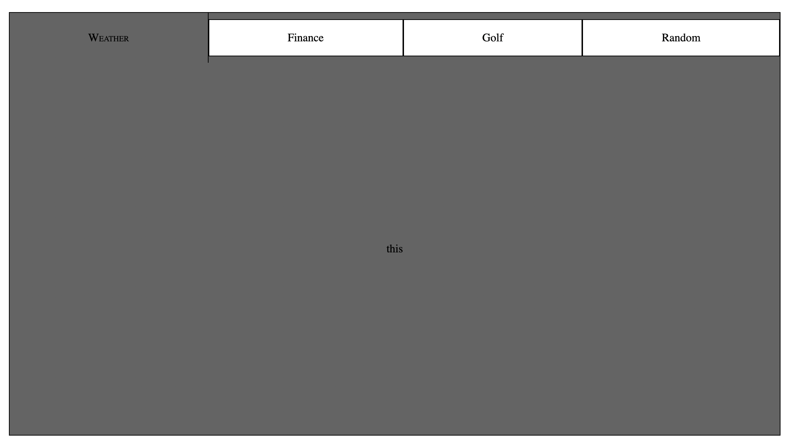

<h1 align="center">tabylon</h1>
<p align="center">This package provides a moderately customizable (more in the works!!), lightweight, modern React functional component tabbed container.</p>
<p align="center">The impetus behind this project was creating a UI driven by a data object, rather than a DOM tree. I have always found thick DOM trees more difficult to read and write than standard data objects. By carefully crafting an array of data, just like you would for a graph visualization, you can create a tabbed data container with just one line of HTML and just a few props.</p>


<p align="center">
    
</p>


## PREQREQUISITES:
- React environment
- package.json ->
    - ```{"type": "module"}```

> ## Installation ->

```npm i tabylonia --save```


> ## Import module

```import { Tabylon } from 'tabylonia'```


> ## Basic HTML Element

```<Tabylon />```

> ## Advance HTML Element with options

```
<Tabylon
    containerStyle={containerStyle}
    tabBarStyle={tabBarStyle}
    tabStyle={tabStyle}
    activeComponentStyle={activeComponentStyle}
    data={data}
    themeType='light'
/>
```


> ## OPTIONS
<h1 align="center">containerStyle = {}</h1>

| Name | PropType | Default value | Description |
| :--- | :------- | :------ | :---------- |
| bgcolor | string | rgba(0,0,0)| background color for element container |
| fcolor | sgtring | rgba(255,255,255)| initial font color for entire element |
| dcolor | string | rgba(255,255,255,.5)| initial text decoration color
```
containerStyle = {
        bgcolor: 'rgba(0,0,0)',
        fcolor: 'rgba(255,255,255)',
        dcolor: 'rgba(255,255,255,.5)'
    }
```

<h1 align="center">tabBarStyle = {}</h1>

| Name | PropType | Default value | Description |
| :--- | :------- | :------ | :---------- |
| height | string | '5em'| starting height of tab bar |
| width | string | '100%'| starting width of tab bar |

```
tabBarStyle: {
        height: '5em',
        width: '100%',
    }
```


<h1 align="center">tabStyle = {}</h1>

| Name | PropType | Default value | Description |
| :--- | :------- | :------ | :---------- |
| titleAlign | string | 'center' | alignment of tab title when not active |
| titleAlignActive | string | 'flex-start' | alignment of tab title when active |
| style | string | 'standard' | tab theme definer (not done) |
| grow | boolean | false | true: applies flex grow (tabs grow to take all availabe space when active), false: sets static witdth of tabs |
| bcolor | string | 'rgba(255, 255, 255, 0.5)'| non-active tab background color |
| acolor | string | 'rgba(255,255,255)'| active tab background color |

```
tabStyle = {
        titleAlign: 'center',
        titleAlignActive: 'flex-start',
        style: 'standard',
        grow: false,
        bcolor: 'rgba(255, 255, 255, 0.5)',
        acolor: 'rgba(255,255,255)',
    }
```


<h1 align="center">activeComponentStyle = {}</h1>

| Name | PropType | Default value | Description |
| :--- | :------- | :------ | :---------- |
| bgcolor | string | 'rgba(255,255,255)' | active panel background color (img/video capability coming next) |
| flexDirection | string | 'column' | flex direction |
| justifyContent | string | 'center' | horizontal align |
| alignItems | string | 'center' | vertical align |

```
activeComponentStyle = {
        bgcolor: 'rgba(255,255,255)',
        flexDirection: 'column',
        justifyContent: 'center',
        alignItems: 'center'
    }
```

<h1 align="center">themeType = ""</h1>
<p align="center">There are only three options to pass here, standard and light and browser (more coming soon!!). pick you favorite or design a brand new one using the available styling props (see above)</p>

```themeType = 'light' OR themeType = 'standard' OR themeType = 'browser'```


<h1 align="center">height = "" && width = ""</h1>
<p align="center">these are for setting the size of the element inside the parent container. Use vh/vw for sizing relative to window and percentages for relative to parent element. starts at 100%, takes entire space of parent element.</p>


```height = '100%'```<p>     </p>
```width = '100%'```
<hr>

<h2 align="center"><strong>THE CURRENT STATE OF SIZING THE ELEMENT</strong></h2> 

### __Until I can really nail down the sizing of the element by passing props (doesn't quite work the way I expected it too... I guess I should have expected that), use a parent element inside the client to generate size constraints and leaving the height and width props at 100% OR not including them at all as they are packaged as defaults anyway__

```
<div className="holder">
    <Tabylon (...props) />
</div>
________________________

.holder {
    width: 50%;
    max-height: 50%;
    display: flex;
    flex: 1 1 auto;
}
```

<hr>

<h1 align="center">margin = ""</h1>
<p align="center">initialized at '0 auto' to compensate for centering <'100%' width element</p>


```margin = '0 auto'```


<h1 align="center">data = []</h1>
<p align="center">This is where the magic happens. All of the tabs as well as the managment of the active container are run from the data object. The reason I designed it this way was to give the developer the greatest freedom in combination with the high iteration speed. By passing an array of specifically crafted data objects, perhaps collated from database call or API hits, all UI management is taken care of without adding a confusing tree of HTML elements. Following are two examples of how to pass data to the active component as it stands.</p>

__Each constituent object of the data array must have at least three named properties, name, tabContent.subtitle and data. Name is the tab identifier, tabContent.subtitle is the text content of the tab, and data is the component passed to the active panel.__

``` 
THE DATA OBJECT:
the component passed into the data property will show up in the active container panel.

data: [
        {
            name: 'one', 
            tabContent: {
                subtitle: 'Weather',
            },
            activeTabContent: {
                elOne: {
                    title: 'link one',
                    alt: 'link one',
                    link: '/'
                },
                elTwo: {
                    title: 'link two',
                    alt: 'link two',
                    link: '/'
                },
            },
            data: <Component />
        },
        {
            name: 'two', 
            tabContent: {
                subtitle: 'Finance',
            },
            activeTabContent: {
                elOne: {
                    title: 'link one',
                    alt: 'link one',
                    link: '/'
                },
                elTwo: {
                    title: 'link two',
                    alt: 'link two',
                    link: '/'
                },
            },
            data: <Component />
        },
        {
            name: 'three', 
            tabContent: {
                subtitle: 'Golf',
            },
            activeTabContent: {
                elOne: {
                    title: 'link one',
                    alt: 'link one',
                    link: '/'
                },
                elTwo: {
                    title: 'link two',
                    alt: 'link two',
                    link: '/'
                },
            },
            data: <Component />
        },
        {
            name: 'four', 
            tabContent: {
                subtitle: 'Random',
            },
            activeTabContent: {
                elOne: {
                    title: 'link one',
                    alt: 'link one',
                    link: '/'
                },
                elTwo: {
                    title: 'link two',
                    alt: 'link two',
                    link: '/'
                },
            },
            data: <Component />
        },
```

<p align="center">
    <video controls width="600">
        <source src="images/TabylonVid1.mov">
    </video>
</p>


<hr>

## Roadmap
See the [open issues](https://github.com/jazznerd206/tabylon/issues) for a list of proposed features (and known issues).

<!-- CONTRIBUTING -->

## Contributing

Contributions are what make the open source community such an amazing place to be learn, inspire, and create. Any contributions you make are **greatly appreciated**.

1. Fork the Project
2. Create your Feature Branch (`git checkout -b feature/AmazingFeature`)
3. Commit your Changes (`git commit -m 'Add some AmazingFeature'`)
4. Push to the Branch (`git push origin feature/AmazingFeature`)
5. Open a Pull Request

<!-- LICENSE -->

## License

Distributed under the UnLicense. See `LICENSE` for more information.

<!-- CONTACT -->

## Contact

-   linkedIn: https://www.linkedin.com/in/andrew-miller-113a1a195/
-   Gertherb: [https://github.com/jazznerd206/tabylon](https://github.com/jazznerd206/tabylon)
